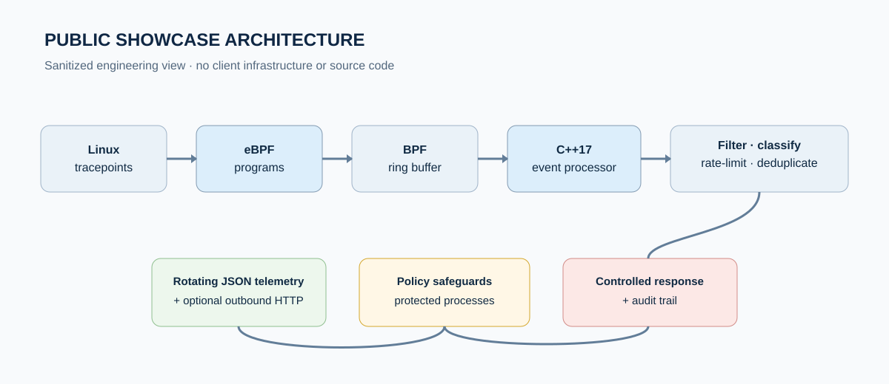
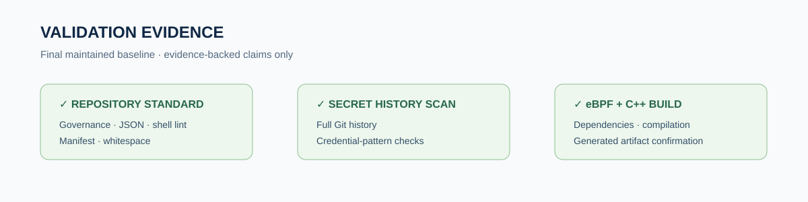

# Raspberry Pi 5 eBPF Security Monitoring Case Study

> **PUBLIC SHOWCASE · SANITIZED · PORTFOLIO-SAFE**
>
> This repository is a public engineering proof artifact. It contains **no client-delivery source code, no client identity, no private infrastructure, no credentials, and no contact information**.



## What this repository is

An anonymized case study for a completed Raspberry Pi 5 / ARM64 Linux security-monitoring engagement built with C++17, eBPF, and libbpf.

The underlying delivery implementation captured kernel-level process, file, network, and privilege-related telemetry through eBPF tracepoints, streamed events through a BPF ring buffer into a C++17 user-space processor, reduced noise through filtering and rate controls, wrote rotating JSON telemetry, supported optional outbound HTTP forwarding, and applied reviewed process policies with protected-process safeguards and an audit trail.

## Public vs. private repository boundary

| Area | This public showcase | Confidential delivery repository |
|---|---|---|
| Visibility | **Public** | **Private** |
| Purpose | Portfolio, proposals, capability proof | Engineering source of truth |
| Source code | **Not included** | Included |
| Client identity | **Not included** | Protected/confidential |
| Credentials/endpoints | **Not included** | Controlled operational context |
| Production configuration | **Not included** | Controlled operational context |
| Case-study document | Included | Not the public artifact |
| Safe to share in a relevant proposal | **Yes** | **No** |

**Rule of thumb:** if you are looking at a repository that contains source code, operational policy files, production configuration, or client-delivery history, you are not looking at this public showcase.

## Challenge

- Capture low-level Linux activity on resource-constrained ARM64 hardware without deploying a heavyweight monitoring stack.
- Convert noisy kernel events into structured telemetry with filtering, deduplication, rate limiting, and severity classification.
- Support controlled response actions while reducing the risk of terminating protected or critical processes.
- Preserve local evidence even when an optional remote receiver is unavailable.
- Leave a reproducible, maintainable handover with CI validation, security checks, and explicit scope boundaries.

## Architecture

```text
Linux tracepoints
      ↓
eBPF programs
      ↓
BPF ring buffer
      ↓
C++17 event processor
      ↓
Filtering · deduplication · rate limiting · severity
      ↓
Rotating JSON telemetry
      ↓
Optional outbound HTTP forwarding
      ↓
Policy safeguards
      ↓
Controlled enforcement + audit trail
```

## Engineering highlights

- **Kernel telemetry:** eBPF tracepoints for process execution/lifecycle, file/syscall activity, IPv4 connect activity, and privilege-change signals.
- **Efficient transport:** BPF ring-buffer delivery from kernel space to the C++17 user-space processor.
- **Noise control:** ignore lists, spam filtering, duplicate suppression, and per-process event rate limiting.
- **Severity classification:** structured runtime severity mapping into JSON telemetry.
- **Durable local evidence:** rotating JSON Lines telemetry independent of remote receiver availability.
- **Remote integration:** optional outbound HTTP JSON forwarding to a controlled receiver.
- **Policy controls:** reviewed alert/controlled-terminate rules with automatic policy reload.
- **Safety guardrails:** protected PIDs/processes and a dedicated enforcement audit trail.
- **Command bridge:** validated local command-ingestion flow with dry-run support.

## Validation evidence



The maintained delivery baseline passed three independent GitHub Actions jobs:

1. **Repository standard** — governance files, manifest, JSON syntax, shell lint, and whitespace checks.
2. **Secret history scan** — full-history scan for high-confidence credential patterns.
3. **Build eBPF and C++ loader** — dependency installation, eBPF/C++ build, and artifact confirmation.

The completed delivery baseline was versioned as **v1.0.0**.

> CI evidence proves automated repository/security/build validation. It does not replace target-device runtime validation on a supported Raspberry Pi 5 / ARM64 Linux system with appropriate privileges.

## Technology

`C++17` · `C` · `eBPF` · `libbpf` · `Linux` · `Raspberry Pi 5` · `ARM64` · `JSON` · `HTTP` · `GitHub Actions`

## What is intentionally not claimed

This showcase does **not** claim:

- a built-in authenticated inbound HTTP control plane;
- XDP/LSM enforcement;
- kernel-integrity analytics;
- Grafana dashboards;
- multi-device fleet management;
- RL/DQN inference;
- unverified latency, detection-rate, ROI, or cost-saving metrics.

## Full case study

[**Read the full public case study**](case-study.md)

Additional public-safe technical detail is available in:

- [Technical overview](docs/technical-overview.md)
- [Validation evidence](docs/validation-evidence.md)
- [Disclosure boundary](docs/disclosure-boundary.md)

## Disclosure boundary

This repository intentionally omits client identity, personal details, email addresses, phone numbers, physical addresses, social handles, credentials, private repository URLs, production endpoints, contract/payment information, private conversations, and client-delivery source code.

This is a **sanitized public showcase**, not the client-delivery repository.
